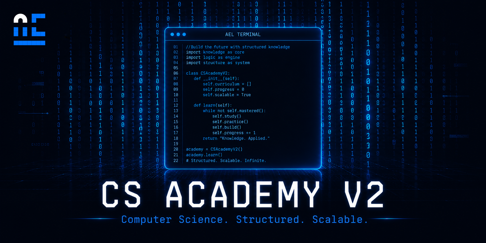

# AEL CS Academy — V2 Scaffold



**Version:** 0.1.0 — Pre-release

An interactive, zero-dependency Q&A browser for computer science problem-solving topics. Built with vanilla HTML5, CSS3, and JavaScript (ES6 class-based engine).

## 📚 Learning Metadata

| | |
|---|---|
| **Learning Level** | Beginner → Intermediate (Pre-release scaffold) |
| **Estimated Duration** | Self-paced (10,000 Q&A cards) |
| **Prerequisites** | Basic computer science concepts |
| **Learning Outcomes** | Practice CS problem-solving with 10,000 Q&A cards, filter by difficulty and type, track progress with bookmarks |

---

## Overview

This project is a static single-page application that renders 10,000 CS Q&A cards from a local data file with client-side pagination (50 cards per page). It provides search, filtering by difficulty and question type, bookmarking, and deep linking.

**Important:** The entire dataset is synthetically generated as a structural scaffold. Questions, answers, and code examples are placeholder text produced by a template generator. This project demonstrates the engine's rendering and filtering capabilities — it is not a curated educational resource. See [CHANGELOG](./CHANGELOG.md) for the current release status.

---

## Features

- 10,000 Q&A cards with client-side pagination (50/page)
- Debounced keyword search across questions and answers
- Filter by difficulty (Beginner–Interview) and question type
- Bookmark cards (persisted via localStorage)
- URL hash-based deep linking
- Dark-mode glassmorphism UI
- Semantic HTML5 with ARIA attributes
- Zero dependencies — no build tools, no server required

---

## Quick Start

```bash
git clone <repo-url>
cd cs-academy-v2
open index.html
```

Works in any modern browser. No installation required.

---

## Project Structure

```
cs-academy-v2/
├── index.html            # Main HTML file
├── styles.css            # All styles (dark theme, glassmorphism)
├── app.js                # Application logic (render, search, filter, paginate, bookmark)
├── data.js               # Q&A dataset (10,000 records, ~16 MB)
├── generate_cs_v2.js     # Node.js script used to generate the dataset
├── ael-logo.svg          # AEL brand logo
├── README.md
├── LICENSE               # MIT
├── CHANGELOG.md
└── .gitignore
```

---

## Data

- **Format:** JSON-style array of objects with fields: id, question, detailedAnswer, difficulty, type, tags, source, and more.
- **Count:** 10,000 records.
- **Size:** ~16 MB (unminified, pretty-printed). Expect ~5 MB minified.
- **Generator:** `generate_cs_v2.js` produces the dataset from a topic template.
- **Note:** All content is synthetically generated placeholder text.

---

## Generating Data

```bash
node generate_cs_v2.js
```

This will overwrite `data.js`. The script uses CommonJS `require('fs')` and runs in Node.js.

---

## Known Limitations

- 16 MB synchronous data load blocks rendering until the file is parsed.
- All content is placeholder data — not suitable as a learning resource without replacement.
- 5 data fields (`relatedConcepts`, `relatedReferences`, `interviewRelevance`, `tags`, `source`) are not rendered in the current UI.

---

## 🔗 Related Resources

- [AEL Learning Catalog](https://github.com/aymanelmasryael/ael-learning-catalog) — Central entry point to all AEL courses
- [CS50 Companion](https://github.com/aymanelmasryael/AEL-Sovereign-CS50x-2026-2027) — Harvard CS50x master citadel with exams, IDE, and AI prompt engineering
- [Problem Solving Academy](https://github.com/aymanelmasryael/problem-solving-academy) — 256 problem-solving modules for C# and Unity

---

## License

MIT — see [LICENSE](./LICENSE).

---

## Author

**Ayman Elmasry** — AEL Digital Studio
